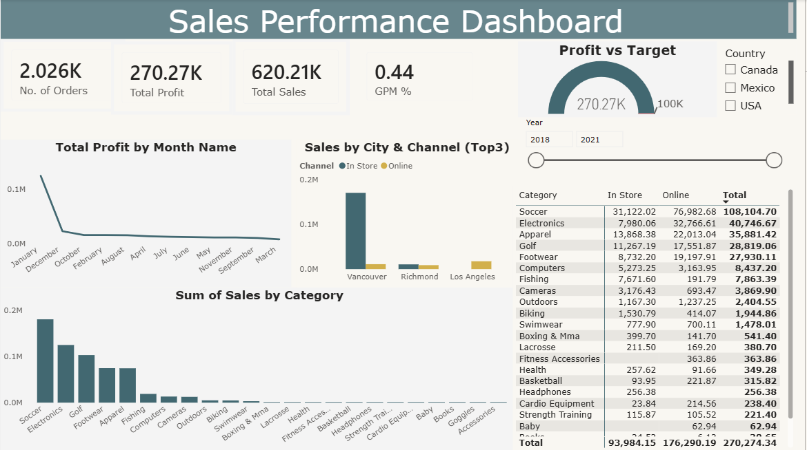

#  Sales Comparative Analysis Dashboard

##  Overview
This project analyzes sales performance using a Power BI dashboard. It focuses on comparing results across product categories, sales channels, and cities to identify trends and support better decisions.

##  Key Insights
- Top categories: Soccer and Electronics  
- Online channel outperforms Store  
- Vancouver is the top-performing city  

##  KPIs
- Total Sales  
- Total Profit  
- Orders Count  
- Profit Margin  

##  Tools
Power BI, Power Query, DAX, Data Modeling  

##  Dashboard Preview

