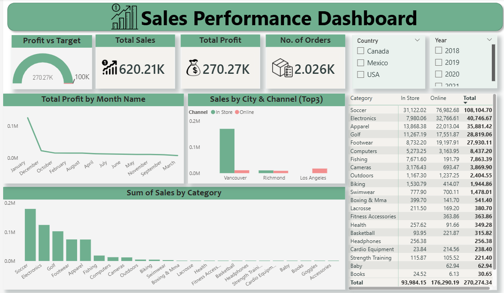

# Sales Performance Dashboard

## Project Overview

An interactive Sales Performance Dashboard built with Power BI to analyze sales and profit performance across different business dimensions.

The dashboard provides a clear view of overall performance and allows users to explore the data interactively by country, year, category, sales channel, city, and month.

## Objectives

The dashboard was designed to:

- Analyze total sales and total profit.
- Compare Online and In-Store sales channels.
- Evaluate performance across product categories.
- Compare sales performance across cities.
- Analyze monthly profit trends.
- Track overall performance against the target.

## Key Insights

- The Online channel generated higher total profit than the In-Store channel.
- Soccer and Electronics were the top-performing categories by sales.
- Vancouver showed the highest sales performance among the displayed cities.
- Sales and profit performance varied across categories, cities, channels, and months.

## Dashboard Preview

## Tools Used

- Power BI
- DAX
- Data Cleaning
- Data Modeling
- Data Visualization
- Dashboard Design

## Recommendations

- Continue analyzing and strengthening the Online sales channel.
- Maintain focus on high-performing categories such as Soccer and Electronics.
- Leverage strong-performing cities such as Vancouver while monitoring performance across other locations.

## Project File

- `Sales Performance Dashboard.pbix` — Power BI dashboard file
